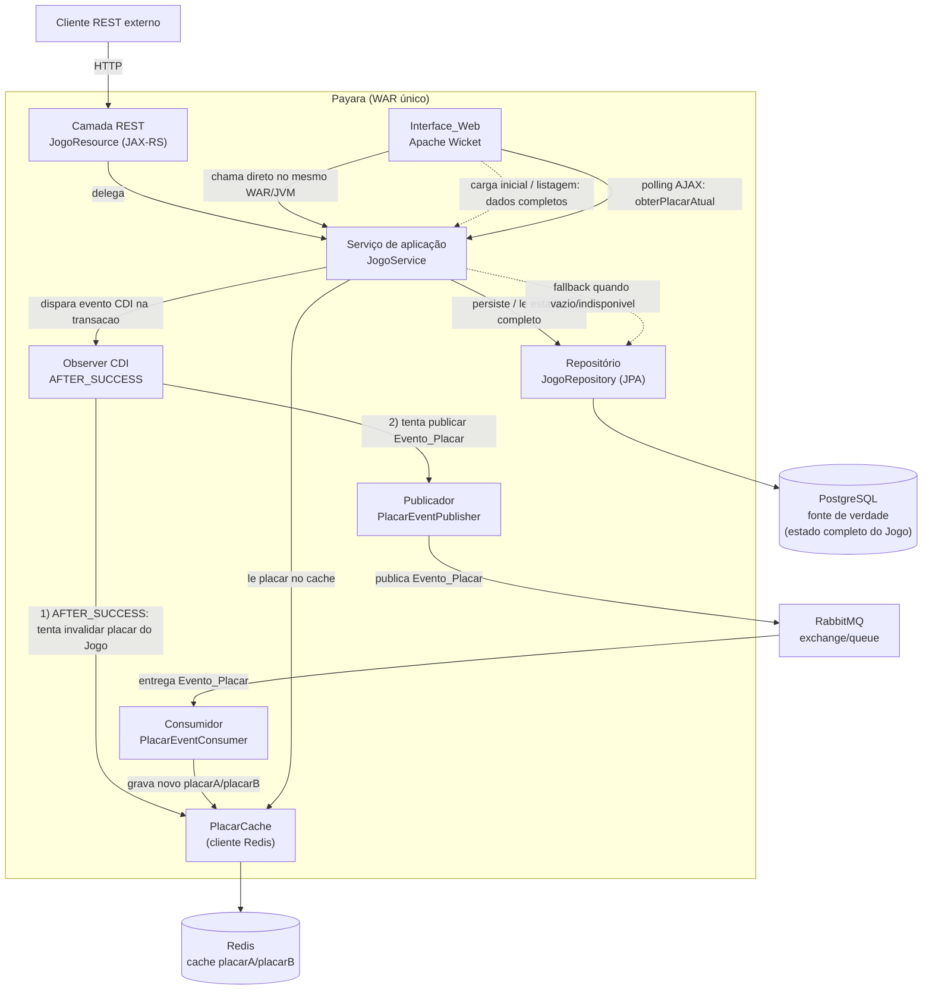

# Design Document

## Overview

Este documento descreve o design do Sistema de gerenciamento de placares de jogos de futebol em tempo real. A solução é um **monólito Jakarta EE** empacotado como um **único artefato WAR**, implantado no **Payara**. Não há microserviços, autenticação/autorização nem frameworks fora do stack exigido pelo steering.

O Sistema expõe uma API REST (JAX-RS) sob o recurso `/jogos` que permite criar, listar/filtrar, buscar, atualizar placar e encerrar jogos. As regras de negócio e a orquestração dos casos de uso residem em um serviço de aplicação, a persistência é feita em **PostgreSQL via JPA**, e a documentação da API é publicada em **OpenAPI/Swagger**.

### Fonte de verdade e papel do cache

O **PostgreSQL é a única fonte de verdade** e armazena o estado completo do Jogo: `id`, `timeA`, `timeB`, `placarA`, `placarB`, `status` e `dataHoraPartida`. O **Redis não substitui o PostgreSQL**: ele é apenas um cache do placar atual (`placarA`/`placarB`), usado para acelerar as consultas frequentes disparadas pela atualização automática da Interface_Web. Se o Redis for limpo, reiniciado ou ficar indisponível, **nenhuma informação oficial do Jogo é perdida**, porque tudo já está no PostgreSQL; a leitura simplesmente volta a buscar o placar diretamente no banco.

Colaboração entre os componentes:

- **Clientes REST externos** acionam a **Camada REST (JAX-RS, `JogoResource`)**, que delega ao **Serviço de aplicação (`JogoService`)**.
- A **Interface_Web (Apache Wicket)** roda no mesmo WAR/JVM e chama o **`JogoService` diretamente**, sem passar por HTTP nem chamar a própria API REST. O `JogoService` orquestra os casos de uso compartilhados pelos dois caminhos (validações, transição de status, imutabilidade do placar encerrado).
- O Serviço usa o **Repositório JPA (`JogoRepository`)** para persistir e ler no PostgreSQL (fonte de verdade).
- Ao atualizar o placar, o Serviço dispara, **dentro da transação**, um **evento CDI (`PlacarAtualizadoEvent`)**. Um **observer CDI** com `@Observes(during = TransactionPhase.AFTER_SUCCESS)` só é executado **quando a transação é efetivamente commitada**; é ele que **tenta invalidar o placar daquele Jogo no Redis** e, em seguida, **tenta acionar** o **Publicador RabbitMQ (`PlacarEventPublisher`)**, que publica o `Evento_Placar`.
- Um **Consumidor RabbitMQ (`PlacarEventConsumer`)** recebe o evento e **grava o novo placar no Redis** (via `PlacarCache`).
- A **Interface_Web** exibe o placar atual e se atualiza automaticamente, sem recarregamento manual, por meio de polling AJAX periódico nativo do Wicket. Nesse polling ela chama `JogoService.obterPlacarAtual(jogoId)`, deixando a cargo do serviço a decisão entre Redis e fallback ao PostgreSQL.

### Decisões de design principais

1. **PostgreSQL fonte de verdade, Redis é cache do placar atual.** O PostgreSQL guarda o estado completo do Jogo. O Redis armazena **somente** `placarA` e `placarB` (nunca `timeA`, `timeB`, `status` ou `dataHoraPartida`), servindo às consultas frequentes da atualização automática da tela — evitando ir ao PostgreSQL só para verificar se o placar mudou. Perder o Redis não perde dado oficial.

2. **Dois caminhos de leitura distintos.**
   - **Carga inicial / listagem dos jogos:** `Interface_Web → JogoService → PostgreSQL`. Todos os dados completos do Jogo vêm do PostgreSQL.
   - **Atualizações automáticas periódicas da tela (polling do Wicket):** `Wicket polling → JogoService.obterPlacarAtual(...)`. É o `JogoService` que decide a origem do placar: consulta o `PlacarCache` (Redis) e, se houver valor, usa o placar do Redis; se não houver ou o Redis estiver indisponível, busca `placarA`/`placarB` no PostgreSQL. A Interface_Web não conhece a estratégia Redis + fallback; ela apenas chama o serviço de aplicação. Os demais dados do Jogo continuam vindo do PostgreSQL.

3. **Invalidação de cache para evitar placar desatualizado.** Ao atualizar o placar, um **observer CDI executado em `TransactionPhase.AFTER_SUCCESS`** — portanto somente após a transação ser efetivamente commitada no PostgreSQL — **tenta invalidar/remover** a chave daquele Jogo no Redis e, em seguida, **tenta publicar** o `Evento_Placar`; a invalidação e a publicação são independentes, de modo que uma falha na invalidação não impede a tentativa de publicação. No **fluxo normal**, isso evita o cenário "PostgreSQL = placar novo, Redis = placar antigo": no intervalo entre a invalidação e a gravação do novo placar pelo Consumer, a chave fica ausente e a leitura cai no PostgreSQL, que já tem o valor novo (Requisito 7.5). Não há versionamento de eventos, timestamps de versão, deduplicação, CQRS, Event Sourcing nem Outbox Pattern.

4. **Atualização automática da Interface_Web — polling AJAX nativo do Wicket.** É usado o `AjaxSelfUpdatingTimerBehavior` do Wicket para atualizar periodicamente o componente que exibe os placares, buscando somente os dados necessários para atualizá-los. O intervalo é configurável e **não é tratado como SLA de requisito**. Não se usa WebSocket, coerente com o steering (preferir a solução mais simples).

5. **Identificador do jogo — `Long` com identidade gerada pelo banco.** O `id` é um `Long` gerado por identidade (`GenerationType.IDENTITY`). É a opção mais simples, legível em URLs (`/jogos/1`) e suficiente para um único banco relacional.

## Architecture

O Sistema é um único WAR no Payara. O diagrama abaixo mostra os componentes e os caminhos relevantes: escrita síncrona de placar, invalidação de cache, propagação assíncrona e os dois caminhos de leitura.



### Fluxo síncrono de escrita (atualizar placar) — ordem exata

A invalidação do cache e a publicação do evento só acontecem **depois** que a transação do novo placar for efetivamente **commitada** no PostgreSQL, garantidas pela fase `AFTER_SUCCESS` de um observer CDI:

1. `PUT /jogos/{id}/placar` chega ao `JogoResource` (ou o Wicket chama `JogoService` diretamente).
2. Delega ao `JogoService.atualizarPlacar(id, placarA, placarB)`, que é **transacional** (JTA/`@Transactional`).
3. Dentro da transação, o Serviço **valida o Jogo e a regra de negócio**: carrega o jogo do PostgreSQL. Se não existir → 404. Se o status for ENCERRADO → 409 (sem publicar evento, sem invalidar cache, placar inalterado). Se `placarA`/`placarB` forem inválidos → 400 (sem publicar evento, sem invalidar cache).
4. Com o jogo EM_ANDAMENTO e placar válido, o Serviço **persiste o novo placar no PostgreSQL** (ainda dentro da transação).
5. Ainda **dentro da transação**, o Serviço **dispara um evento CDI** `PlacarAtualizadoEvent` (contendo `jogoId`, `placarA`, `placarB`) via `jakarta.enterprise.event.Event.fire(...)`.
6. Quando a transação é **commitada com sucesso**, o **observer CDI** anotado com `@Observes(during = TransactionPhase.AFTER_SUCCESS)` é executado e trata **duas integrações independentes**: (a) tenta **invalidar/remover do Redis o placar daquele Jogo** (`PlacarCache.invalidar(jogoId)`) e (b) tenta **publicar o `Evento_Placar` no RabbitMQ** (`PlacarEventPublisher.publicar(evento)`). Cada tentativa fica em seu próprio bloco de tratamento de erro: se a invalidação do Redis falhar, a falha é **registrada em log** e a publicação é **mesmo assim tentada**; se a publicação falhar, a falha também é **registrada em log**. Como o commit no PostgreSQL já ocorreu, **nenhuma dessas falhas o desfaz**.
7. `JogoResource` retorna HTTP 200 com o jogo atualizado.

**Por que invalidar antes de o Consumer gravar:** no intervalo entre o commit (passo 6) e o processamento do evento pelo Consumer (fluxo assíncrono), a chave do Jogo no Redis fica **ausente**. Toda leitura de placar nesse intervalo cai no fallback para o PostgreSQL, que já tem o valor novo. Assim, no fluxo normal, evita-se exibir o valor antigo do cache (Requisito 7.5).

**Garantia de ordem com Jakarta EE/JTA:** a garantia de que a sequência **transação commitada → (tentar) invalidar Redis → (tentar) publicar `Evento_Placar`** ocorre nessa ordem vem da fase `AFTER_SUCCESS` do observer CDI, e **não** do simples retorno do método transacional. `JogoService.atualizarPlacar(...)` persiste o novo placar e dispara o evento CDI dentro da transação; o observer com `@Observes(during = TransactionPhase.AFTER_SUCCESS)` só é chamado **quando a transação é efetivamente commitada**. No observer, a invalidação do Redis e a publicação no RabbitMQ são **independentes**: a falha da invalidação é apenas logada e **não impede** a tentativa de publicação, e como o observer roda após o commit, essas falhas **não desfazem** o estado já persistido no PostgreSQL. Se a transação sofrer **rollback/falha**, o observer `AFTER_SUCCESS` **não** é chamado: o placar anterior permanece no PostgreSQL, o cache **não** é invalidado e **nenhum** `Evento_Placar` é publicado. Não se usa Outbox Pattern.

```java
public class PlacarAtualizadoObserver {

    // Executado somente quando a transação é efetivamente commitada.
    // Redis e RabbitMQ são tratados de forma independente: a falha de um
    // não desfaz o commit no PostgreSQL nem impede a tentativa do outro.
    void aoConfirmarPlacar(
            @Observes(during = TransactionPhase.AFTER_SUCCESS) PlacarAtualizadoEvent evento) {

        // 1) tenta invalidar o Redis; se falhar, apenas loga e segue em frente
        try {
            placarCache.invalidar(evento.jogoId());
        } catch (Exception e) {
            log.warn("Falha ao invalidar placar no Redis; seguindo para publicação", e);
        }

        // 2) tenta publicar no RabbitMQ mesmo que a invalidação tenha falhado
        try {
            placarEventPublisher.publicar(
                new EventoPlacar(evento.jogoId(), evento.placarA(), evento.placarB()));
        } catch (Exception e) {
            log.warn("Falha ao publicar Evento_Placar no RabbitMQ", e);
        }
    }
}
```

### Fluxo assíncrono (propagação para o Redis)

1. `PlacarEventPublisher` serializa o `Evento_Placar` (`jogoId`, `placarA`, `placarB`) em JSON e publica no RabbitMQ.
2. `PlacarEventConsumer` recebe a mensagem e desserializa o `Evento_Placar`.
3. O Consumidor chama `PlacarCache` para **gravar** no Redis apenas `placarA` e `placarB` do jogo identificado. Não grava status, times nem timestamp. Sem retry/timeout/dedup/ordenação obrigatórios (fora do escopo dos requisitos).

### Ciclo de vida do `PlacarEventConsumer` no Payara

Fluxo conceitual, simples e compatível com Jakarta EE/Payara:

1. **Aplicação inicia** → um componente gerenciado de inicialização (por exemplo, um bean singleton com `@Startup`) inicia o consumidor.
2. O componente **obtém/abre a conexão com o RabbitMQ** e o canal.
3. **Registra o consumo** da fila `placar.atualizado.queue`.
4. Quando o **RabbitMQ entrega uma mensagem**, o consumidor **desserializa o `Evento_Placar`**, chama o `PlacarCache` e o **Redis é atualizado** com o novo placar.
5. No **encerramento da aplicação** (`@PreDestroy`), o componente **libera conexão, canal e demais recursos**.

Não há serviços externos adicionais nem infraestrutura distribuída além de RabbitMQ e Redis já previstos.

### Caminho de leitura 1 — carga inicial / listagem dos jogos

1. A Interface_Web (ou um cliente REST) solicita a lista/detalhe dos jogos.
2. `JogoService` lê o **estado completo** dos jogos do **PostgreSQL** via `JogoRepository`.
3. A tela é montada com os dados completos vindos do PostgreSQL (`timeA`, `timeB`, `placarA`, `placarB`, `status`, `dataHoraPartida`).

### Caminho de leitura 2 — atualização automática periódica (polling do Wicket)

1. A página de jogos registra um `AjaxSelfUpdatingTimerBehavior`.
2. A cada intervalo configurado, o Wicket dispara uma requisição AJAX que busca **somente** os placares exibidos, chamando `JogoService.obterPlacarAtual(jogoId)`.
3. É o `JogoService` que decide a origem do placar: consulta o `PlacarCache` (Redis) e, se houver valor para o jogo → usa `placarA`/`placarB` do Redis; se **não houver** valor ou o Redis estiver **indisponível** → busca `placarA`/`placarB` no **PostgreSQL** via `JogoRepository` (fallback). A Interface_Web não conhece essa estratégia.
4. Os demais dados do Jogo (times, status, dataHoraPartida) continuam vindo do PostgreSQL.
5. O componente é rerenderizado e o usuário vê o placar atualizado sem recarregar a página (Requisito 8). Jogos com status ENCERRADO têm o controle de atualização de placar desabilitado na tela (Requisito 6.2).

## Components and Interfaces

Cada componente tem responsabilidade única. As assinaturas abaixo são o contrato essencial (nomes finais podem variar levemente na implementação, mantendo a intenção).

### 1. `JogoResource` (Camada REST / JAX-RS) — Requisitos 1, 2, 3, 4, 5, 6, 10, 11

Recurso REST sob `/jogos`, usado por **clientes REST externos**. Traduz HTTP ↔ chamadas ao `JogoService` e produz/consome JSON. Anotado com OpenAPI para gerar a documentação. A Interface_Web **não** passa por aqui.

```java
@Path("/jogos")
@Produces(MediaType.APPLICATION_JSON)
@Consumes(MediaType.APPLICATION_JSON)
public class JogoResource {

    // POST /jogos  -> 201 | 400
    Response criar(CriarJogoRequest request);

    // GET /jogos?status=  -> 200 | 400
    Response listar(String status);

    // GET /jogos/{id}  -> 200 | 404
    Response buscarPorId(Long id);

    // PUT /jogos/{id}/placar  -> 200 | 400 | 404 | 409
    Response atualizarPlacar(Long id, AtualizarPlacarRequest request);

    // PUT /jogos/{id}/status  -> 200 | 400 | 404
    Response atualizarStatus(Long id, AtualizarStatusRequest request);
}
```

**Contratos dos endpoints**

| Método | Caminho | Request | Response (sucesso) | Códigos HTTP |
|---|---|---|---|---|
| POST | `/jogos` | `CriarJogoRequest` `{ timeA, timeB, dataHoraPartida }` | `JogoResponse` | 201; 400 (campo obrigatório ausente) |
| GET | `/jogos?status={EM_ANDAMENTO\|ENCERRADO}` (status opcional) | — | `JogoResponse[]` | 200; 400 (status vazio ou inválido) |
| GET | `/jogos/{id}` | — | `JogoResponse` | 200; 404 |
| PUT | `/jogos/{id}/placar` | `AtualizarPlacarRequest` `{ placarA, placarB }` | `JogoResponse` | 200; 400 (placar inválido); 404; 409 (jogo encerrado) |
| PUT | `/jogos/{id}/status` | `AtualizarStatusRequest` `{ status: "ENCERRADO" }` | `JogoResponse` | 200; 400 (valor diferente de `ENCERRADO`); 404 |

**Contrato do `PUT /jogos/{id}/status`** (decisão de design):

Request:

```json
{ "status": "ENCERRADO" }
```

Comportamentos:

- Jogo **EM_ANDAMENTO** + `"ENCERRADO"` → altera para ENCERRADO, preserva `placarA`/`placarB`, **HTTP 200** (Requisitos 5.1, 5.2).
- Jogo **já ENCERRADO** + `"ENCERRADO"` → não altera nada, **HTTP 200** (idempotente — Requisito 5.3).
- **Qualquer outro valor, inclusive `"EM_ANDAMENTO"`** → **HTTP 400** (Requisitos 5.4, 11.2).

Não existe operação de reabrir jogo: a única transição suportada é EM_ANDAMENTO → ENCERRADO (Requisito 5.4).

### 2. `JogoService` (Serviço de aplicação — orquestração dos casos de uso) — Requisitos 1, 2, 3, 4, 5, 6, 7

Responsável pela **orquestração dos casos de uso** compartilhados pela Camada REST e pela Interface_Web. Conhece o `JogoRepository`, o cache (`PlacarCache`) e a mensageria (dispara o evento CDI). Único ponto que decide validações, transição de status e imutabilidade do placar encerrado. Também **centraliza a leitura do placar atual**, decidindo internamente entre Redis (cache) e PostgreSQL (fallback), de modo que a Interface_Web não conheça essa estratégia. O método `atualizarPlacar` é transacional (JTA/`@Transactional`): persiste o novo placar e, ainda dentro da transação, dispara o evento CDI `PlacarAtualizadoEvent`; a invalidação do cache e a publicação do `Evento_Placar` ficam a cargo do observer CDI executado em `TransactionPhase.AFTER_SUCCESS`.

```java
public class JogoService {

    Jogo criar(String timeA, String timeB, OffsetDateTime dataHoraPartida); // valida obrigatórios

    List<Jogo> listar(Status filtroOpcional);   // null = todos (estado completo do PostgreSQL)

    Jogo buscarPorId(Long id);                   // lança NaoEncontradoException

    Jogo atualizarPlacar(Long id, int placarA, int placarB);
    // @Transactional: valida >= 0; 404 se inexistente; 409 se ENCERRADO;
    // persiste no PostgreSQL e dispara PlacarAtualizadoEvent dentro da transação;
    // observer AFTER_SUCCESS invalida o Redis e publica Evento_Placar após o commit

    PlacarAtual obterPlacarAtual(Long jogoId);
    // leitura do placar atual: consulta o PlacarCache (Redis) e, se houver, usa esse valor;
    // se ausente/indisponível, faz fallback para placarA/placarB no PostgreSQL (JogoRepository)

    Jogo encerrar(Long id);                      // EM_ANDAMENTO -> ENCERRADO; idempotente
}
```

### 3. `JogoRepository` (Persistência / JPA) — Requisitos 1.2, 2, 3, 4.2, 5.2, 13.3

Encapsula o acesso ao PostgreSQL via `EntityManager`/JPA. Responsabilidade única: CRUD e consultas de `Jogo` (estado completo, fonte de verdade).

```java
public class JogoRepository {
    Jogo salvar(Jogo jogo);
    Optional<Jogo> buscarPorId(Long id);
    List<Jogo> listarTodos();
    List<Jogo> listarPorStatus(Status status);
}
```

### 4. `PlacarEventPublisher` (Mensageria — publicação) — Requisito 4.3, 7.1

Publica o `Evento_Placar` no RabbitMQ quando acionado pelo `PlacarAtualizadoObserver`. Isso ocorre em `TransactionPhase.AFTER_SUCCESS`, portanto o PostgreSQL já foi commitado. Antes da publicação, o observer faz uma **tentativa** de invalidar o cache; mesmo que essa invalidação falhe, a publicação no RabbitMQ ainda é tentada. As duas integrações são **independentes**, com tratamento de erro separado. Serializa o evento em JSON.

```java
public class PlacarEventPublisher {
    void publicar(EventoPlacar evento); // publica JSON no exchange configurado
}
```

### 5. `PlacarEventConsumer` (Mensageria — consumo) — Requisito 7.2

Iniciado por um bean gerenciado (`@Startup`) e finalizado no `@PreDestroy` (ver ciclo de vida em Architecture). Consome mensagens da fila `placar.atualizado.queue`, desserializa o `Evento_Placar` e grava o novo placar no Redis via `PlacarCache`.

```java
public class PlacarEventConsumer {
    void iniciar();                       // @Startup: abre conexão/canal, registra consumo
    void aoReceber(String mensagemJson);  // desserializa e chama PlacarCache.atualizar(...)
    void encerrar();                      // @PreDestroy: libera conexão/canal/recursos
}
```

### 6. `PlacarCache` (Cache de placar sobre Redis) — Requisitos 7.2, 7.3, 7.4, 7.5, 8

Abstrai o acesso ao Redis. Guarda **apenas** `placarA`/`placarB` por jogo. Expõe operações de gravação, leitura e invalidação.

```java
public class PlacarCache {
    void atualizar(Long jogoId, int placarA, int placarB); // grava no Redis (chamado pelo Consumer)
    Optional<PlacarAtual> ler(Long jogoId);                // vazio se ausente/indisponível
    void invalidar(Long jogoId);                           // remove a chave do Jogo (observer AFTER_SUCCESS)
}
```

### 7. Interface_Web (Apache Wicket) — Requisitos 6.2, 8, 9

Páginas/painéis que operam os jogos e exibem placar em tempo real. **Roda no mesmo WAR/JVM** e chama o `JogoService` **diretamente**, sem fazer HTTP contra a própria API REST. A leitura do placar atual passa pelo `JogoService.obterPlacarAtual(...)`; a Interface_Web não consulta o `PlacarCache` diretamente nem implementa a estratégia Redis + fallback.

- `JogosPage`: página principal. Lista os jogos (dados completos via `JogoService` → PostgreSQL), oferece filtro por status, e hospeda o `AjaxSelfUpdatingTimerBehavior` para atualização automática do placar (Requisito 8), que chama `JogoService.obterPlacarAtual(...)` — é o serviço que decide entre Redis e fallback ao PostgreSQL.
- `CriarJogoPanel`/formulário: cria jogo informando timeA, timeB e dataHoraPartida (Requisito 9.1).
- `PlacarPanel`: exibe e permite atualizar placar de jogos EM_ANDAMENTO; o controle de atualização fica desabilitado para jogos ENCERRADO (Requisitos 9.2, 6.2).
- Ação de encerrar jogo (Requisito 9.3) e filtro de status (Requisito 9.4).
- Tratamento de erro: ao o Sistema recusar uma operação, exibe a mensagem de erro recebida e mantém os valores exibidos antes da operação (Requisito 9.5).

### 8. Documentação OpenAPI/Swagger — Requisito 10

A documentação é gerada a partir das anotações OpenAPI no `JogoResource` e exposta via Swagger UI enquanto o Sistema roda no Payara, cobrindo os cinco endpoints.

### Topologia RabbitMQ (simples) — Requisito 7

- **Exchange**: `placar.exchange` (tipo `direct`).
- **Routing key**: `placar.atualizado`.
- **Queue**: `placar.atualizado.queue`, vinculada ao exchange pela routing key.
- **Mensagem**: JSON do `Evento_Placar` (ver Data Models).

O publicador envia para `placar.exchange` com routing key `placar.atualizado`; o consumidor escuta `placar.atualizado.queue`. Sem dead-letter, retry ou TTL (não exigidos pelos requisitos).

### Chave e valor no Redis — Requisito 7.2

- **Chave**: `jogo:{id}:placar` (ex.: `jogo:42:placar`).
- **Valor**: JSON `{"placarA": <int>, "placarB": <int>}`.

Somente placar é armazenado; status, times e dataHoraPartida **não** ficam no Redis. A invalidação (pelo observer CDI em `AFTER_SUCCESS`, após o commit da atualização) **tenta remover** essa chave.

## Data Models

### Entidade JPA `Jogo` — Requisitos 1, 3, 4, 5, 13.3

O PostgreSQL guarda o estado completo do Jogo por meio desta entidade (fonte de verdade).

```java
@Entity
@Table(name = "jogo")
public class Jogo {

    @Id
    @GeneratedValue(strategy = GenerationType.IDENTITY)
    private Long id;

    @Column(nullable = false)
    private String timeA;

    @Column(nullable = false)
    private String timeB;

    @Column(nullable = false)
    private int placarA = 0;

    @Column(nullable = false)
    private int placarB = 0;

    @Enumerated(EnumType.STRING)
    @Column(nullable = false, length = 20)
    private Status status = Status.EM_ANDAMENTO;

    @Column(nullable = false)
    private OffsetDateTime dataHoraPartida;
}
```

- `id`: `Long`, gerado por identidade do banco (justificativa na seção Overview).
- `placarA`/`placarB`: `int`, default 0, sempre `>= 0` (garantido pela validação de domínio).
- `status`: enum persistido como texto (`EnumType.STRING`) para legibilidade no banco.
- `timeA` igual a `timeB` é permitido (nenhuma restrição de igualdade).

### Enum `Status`

```java
public enum Status {
    EM_ANDAMENTO,
    ENCERRADO
}
```

### DTOs de request/response

```java
// POST /jogos
public record CriarJogoRequest(String timeA, String timeB, OffsetDateTime dataHoraPartida) {}

// PUT /jogos/{id}/placar
public record AtualizarPlacarRequest(Integer placarA, Integer placarB) {}
// Integer (não int) para distinguir "ausente/null" de 0 e retornar 400 quando ausente.

// PUT /jogos/{id}/status
public record AtualizarStatusRequest(String status) {} // único valor aceito: "ENCERRADO"

// Resposta padrão de jogo
public record JogoResponse(
    Long id, String timeA, String timeB,
    int placarA, int placarB, String status, OffsetDateTime dataHoraPartida) {}

// Corpo de erro padronizado (Requisito 11)
public record ErroResponse(String mensagem) {}
```

Observação sobre leitura de placar: na atualização automática da tela (polling do Wicket), `placarA`/`placarB` são obtidos via `JogoService.obterPlacarAtual(...)`, que decide entre o `PlacarCache` (Redis) quando disponível e o fallback ao PostgreSQL. Os demais campos vêm sempre do PostgreSQL.

### Modelo do `Evento_Placar` — Requisito 7.1

```java
public record EventoPlacar(Long jogoId, int placarA, int placarB) {}
```

Serialização JSON da mensagem RabbitMQ:

```json
{ "jogoId": 42, "placarA": 2, "placarB": 1 }
```

Contém apenas o identificador do jogo (`jogoId`), `placarA` e `placarB` (conforme Requisito 7.1). Nenhum status ou timestamp é transportado.

### Valor do cache `PlacarAtual`

```java
public record PlacarAtual(int placarA, int placarB) {}
```

Reflete exatamente o que o Redis guarda por jogo.

### Estratégia de esquema (DDL via JPA) — Requisito 13.3

O esquema da tabela `jogo` é disponibilizado por JPA na inicialização quando o PostgreSQL está disponível (geração/atualização de esquema controlada por configuração da unidade de persistência, sem DDL manual). Tabela resultante (conceitual):

```
jogo(
  id                BIGINT      PRIMARY KEY (identity),
  time_a            VARCHAR     NOT NULL,
  time_b            VARCHAR     NOT NULL,
  placar_a          INTEGER     NOT NULL DEFAULT 0,
  placar_b          INTEGER     NOT NULL DEFAULT 0,
  status            VARCHAR(20) NOT NULL,
  data_hora_partida TIMESTAMP WITH TIME ZONE NOT NULL
)
```

## Error Handling

O tratamento de erros é padronizado na Camada REST por meio de `ExceptionMapper` (JAX-RS), traduzindo exceções de domínio para códigos HTTP e para um corpo de erro único.

### Exceções de domínio e mapeamento HTTP — Requisito 11

| Exceção de domínio | Situação | HTTP | Requisitos |
|---|---|---|---|
| `EntradaInvalidaException` | campo obrigatório ausente, placar não inteiro/negativo, status vazio/inválido (inclui valor diferente de `ENCERRADO` no `PUT /status`) | 400 | 1.3, 2.5, 2.6, 4.4, 5.4, 11.2 |
| `NaoEncontradoException` | identificador não corresponde a jogo persistido | 404 | 3.2, 4.5, 5.5, 11.3 |
| `JogoEncerradoException` | tentativa de atualizar placar de jogo ENCERRADO | 409 | 6.1, 11.4 |
| (qualquer outra não prevista) | erro inesperado | 500 | 11.5 |

Cada exceção tem um `ExceptionMapper` correspondente; um mapper genérico captura o restante e devolve 500. Todos produzem o mesmo corpo:

```json
{ "mensagem": "descrição do motivo da rejeição" }
```

O campo `mensagem` é sempre descritivo (cita o campo obrigatório ausente, os valores aceitos de status, ou informa que o jogo está encerrado), atendendo ao Requisito 11.1.

### Tratamento de erro na Interface_Web — Requisitos 9.5, 6.2

Ao acionar uma operação (diretamente no `JogoService`), a Interface_Web captura a rejeição do Sistema (exceção de domínio) e:

1. Exibe a mensagem de erro recebida (via `FeedbackPanel` do Wicket).
2. Mantém na tela os valores de placar e status exibidos antes da operação (não aplica o valor que falhou).

Para jogos ENCERRADO, o controle de atualização de placar já é renderizado desabilitado (Requisito 6.2), prevenindo a tentativa antes mesmo da chamada.

### PostgreSQL como fonte de verdade e degradação de Redis/RabbitMQ

O PostgreSQL armazena o estado completo do Jogo e é a única fonte de verdade. **Se o Redis for limpo ou ficar indisponível, nenhuma informação oficial do Jogo é perdida** — a leitura de placar apenas volta a buscar no PostgreSQL. As falhas abaixo são tratadas de forma simples, sem SLAs, retries complexos ou timeouts numéricos (não exigidos pelos requisitos), e as ocorrências relevantes são registradas em log.

- **Transação de placar sofre rollback/falha (PostgreSQL):** o observer CDI `AFTER_SUCCESS` **não** é chamado, portanto o placar anterior permanece no PostgreSQL, o cache **não** é invalidado e **nenhum** `Evento_Placar` é publicado.

- **Falha na invalidação do Redis** (no observer `AFTER_SUCCESS`, com o PostgreSQL já commitado): a falha é registrada em **log** e o observer **ainda assim tenta publicar** o `Evento_Placar` no RabbitMQ. O commit **não** é desfeito. Nesse caso o Redis pode ficar temporariamente com o **valor antigo** do placar; enquanto isso, a leitura via `JogoService.obterPlacarAtual(...)` pode retornar esse valor do Redis até que o Consumer grave o novo placar na próxima publicação bem-sucedida. Não há garantia de consistência absoluta e **não** se adiciona retry/Outbox/versionamento para resolver isso (fora do escopo).

- **Falha na publicação do RabbitMQ** (no observer `AFTER_SUCCESS`, com o PostgreSQL já atualizado, independentemente de a invalidação do Redis ter tido sucesso): o PostgreSQL permanece correto; a falha é registrada em **log**; a persistência **não** é desfeita. Se a invalidação anterior teve sucesso, o Redis fica **sem** aquele placar e as consultas usam o PostgreSQL (fallback); se a invalidação falhou, o Redis pode manter o valor antigo até a próxima publicação bem-sucedida. Não há retry complexo nem Outbox Pattern; o Redis voltará a refletir o placar quando uma próxima atualização for publicada com sucesso.

- **Falha do Redis** (indisponível na leitura, na gravação pelo Consumer, ou na invalidação): criação, atualização e encerramento continuam usando o PostgreSQL e o Jogo continua persistido normalmente; as **leituras de placar fazem fallback para o PostgreSQL** (via `JogoService.obterPlacarAtual(...)`); falhas relevantes são registradas em log. O Redis é otimização de leitura, **não** dependência de durabilidade.

### Consistência do cache — alcance e limites

- **No fluxo normal**, a invalidação disparada pelo observer `AFTER_SUCCESS` evita o cache antigo: no intervalo entre a invalidação e a gravação do novo placar pelo Consumer, a chave fica **ausente** e a leitura cai no PostgreSQL (fonte de verdade), que já tem o valor novo. Não se promete ausência absoluta de cache antigo em todos os cenários de falha.
- **Se a invalidação do Redis falhar**, o sistema **loga** e **ainda tenta publicar** o `Evento_Placar`; se a publicação também falhar, apenas **loga**. Em ambos os casos o PostgreSQL permanece correto (fonte de verdade) e o fallback de leitura cobre o placar. Quando a invalidação falha, o Redis pode ficar temporariamente com o **valor antigo**, e a leitura via `JogoService.obterPlacarAtual(...)` pode retornar esse valor até a próxima gravação do Consumer. Isso é aceito conscientemente: **não** se promete consistência absoluta nem se adiciona retry/Outbox/CQRS/timestamps/versionamento para resolver o cenário (fora do escopo).
- **Em falhas do Redis**, o PostgreSQL continua sendo a fonte de verdade e o sistema faz **fallback** para ele quando o Redis estiver indisponível ou sem valor. Estratégias avançadas de reconciliação de cache após falhas estão **fora do escopo** deste desafio (sem timestamps, versionamento, CQRS, Outbox nem mecanismos distribuídos).

Essa abordagem preserva a integridade do dado oficial no PostgreSQL e mantém a interface funcional mesmo com mensageria/cache degradados.

## Testing Strategy

Os testes automatizados são **diferenciais** deste desafio, não requisitos obrigatórios (Requisito 12): testes unitários com JUnit e testes de API são diferenciais, e os testes do fluxo assíncrono (RabbitMQ/Redis) são opcionais. Como decisão de qualidade, planeja-se escrever **alguns testes simples se houver tempo**, priorizando testes **pequenos, compreensíveis e fáceis de explicar em entrevista**. Todos os testes são compatíveis com **JUnit**; não há uso de property-based testing, não há mínimo de iterações e não há obrigação de cobertura mínima.

### Testes unitários com JUnit (diferencial)

Focados nas principais regras de negócio do `JogoService`, com exemplos concretos e legíveis:

- **Criação inicia placar 0 x 0 e status EM_ANDAMENTO** (Requisitos 1.1, 1.2).
- **Atualização de placar persiste os novos valores** (Requisitos 4.1, 4.2).
- **Jogo ENCERRADO rejeita alteração do placar** (Requisito 6.1).
- **Encerramento preserva `placarA` e `placarB`** (Requisitos 5.1, 5.2).
- **Encerramento repetido é idempotente** (Requisito 5.3).
- **Filtro por status retorna os jogos corretos** (Requisitos 2.2, 2.3, 2.4).
- **Atualização bem-sucedida dispara um `PlacarAtualizadoEvent`** contendo `jogoId`, `placarA` e `placarB` corretos — verificado observando/capturando o evento CDI, sem publicar de fato no RabbitMQ (Requisitos 4.3, 7.1).

### Testes opcionais

- **Observer tenta invalidar cache e publicar mesmo com falha na invalidação:** ao receber um `PlacarAtualizadoEvent` após o sucesso da transação, o `PlacarAtualizadoObserver` **tenta invalidar o cache** e, **independentemente de falha na invalidação**, **tenta publicar o `EventoPlacar` no RabbitMQ** — verificável com cache/publicador falsos que confirmam as duas tentativas e o comportamento de log quando a invalidação falha.
- **Consumer atualiza o Redis:** entregar um `Evento_Placar` ao `PlacarEventConsumer` e verificar que o `PlacarCache` passa a refletir `placarA`/`placarB` (usando um Redis de teste ou um cache falso).
- **Testes da API REST:** exercitar os contratos HTTP dos endpoints (métodos, caminhos, DTOs e códigos 201/200/400/404/409), incluindo o corpo `{"status":"ENCERRADO"}` do `PUT /jogos/{id}/status` e a idempotência do encerramento (200 no segundo pedido).
- **Testes de UI (WicketTester):** por exemplo, painel de jogo ENCERRADO renderiza o controle de atualização desabilitado (6.2) e um ciclo do `AjaxSelfUpdatingTimerBehavior` rerenderiza o placar com o novo valor (8.1, 8.2).

Todos os testes acima — inclusive o do `JogoService` e o do `PlacarAtualizadoObserver` — permanecem **diferenciais/opcionais** (não obrigatórios), compatíveis com **JUnit**, **sem** property-based testing, **sem** jqwik e **sem** novas bibliotecas.

## Estrutura de pacotes proposta

Coerente com o steering (`structure.md`): responsabilidades separadas, sem camadas desnecessárias, nomes que expressam a função. Base sugerida: `com.desafio.placar`.

```
com.desafio.placar
├── domain          # Modelo e regras de negócio
│   ├── Jogo                     (entidade JPA)
│   ├── Status                   (enum)
│   └── excecao
│       ├── EntradaInvalidaException
│       ├── NaoEncontradoException
│       └── JogoEncerradoException
├── service         # Serviço de aplicação (orquestração dos casos de uso)
│   ├── JogoService              (orquestra: criar, atualizarPlacar, encerrar, listar, buscar, obterPlacarAtual)
│   ├── PlacarAtualizadoEvent    (evento CDI interno da aplicação)
│   └── PlacarAtualizadoObserver (observer CDI AFTER_SUCCESS: tenta invalidar Redis e publicar EventoPlacar)
├── persistence     # Acesso ao PostgreSQL via JPA (fonte de verdade)
│   └── JogoRepository
├── api             # Camada REST (JAX-RS) para clientes externos
│   ├── JogoResource
│   ├── dto
│   │   ├── CriarJogoRequest
│   │   ├── AtualizarPlacarRequest
│   │   ├── AtualizarStatusRequest
│   │   ├── JogoResponse
│   │   └── ErroResponse
│   └── mapper                   (ExceptionMappers: 400, 404, 409, 500)
├── messaging       # RabbitMQ
│   ├── PlacarEventPublisher
│   ├── PlacarEventConsumer      (@Startup / @PreDestroy)
│   └── EventoPlacar             (mensagem externa RabbitMQ; não confundir com o evento CDI interno PlacarAtualizadoEvent)
├── cache           # Redis (cache do placar atual)
│   ├── PlacarCache
│   └── PlacarAtual              (valor placarA/placarB)
├── web             # Interface Apache Wicket (chama JogoService direto)
│   ├── JogosPage
│   ├── CriarJogoPanel
│   └── PlacarPanel
└── config          # Configuração (OpenAPI, conexões externas, ativação JAX-RS)
```

- **domain**: modelo e regras de negócio — a entidade `Jogo`, o enum `Status` e as exceções de domínio; sem dependência de JAX-RS/Wicket.
- **service**: serviço de aplicação que orquestra os casos de uso, sem dependência de JAX-RS/Wicket. Contém o `JogoService` (que conhece `JogoRepository`, `PlacarCache` e dispara o evento CDI), o evento CDI interno `PlacarAtualizadoEvent` e o observer `PlacarAtualizadoObserver`. Aqui é importante distinguir dois conceitos que não devem ser confundidos: `PlacarAtualizadoEvent` é um **evento CDI interno** da aplicação — disparado dentro da transação de atualização de placar e observado em `TransactionPhase.AFTER_SUCCESS` pelo `PlacarAtualizadoObserver` — enquanto `EventoPlacar` (no pacote `messaging`) é a **mensagem externa** publicada no RabbitMQ. O evento CDI não trafega pela mensageria; ele apenas aciona, após o commit, a tentativa de invalidar o Redis e de publicar o `EventoPlacar`.
- **persistence**: isolado ao redor do `EntityManager`/JPA (PostgreSQL, fonte de verdade).
- **api**: tradução HTTP para clientes externos; sem lógica de negócio além de orquestração.
- **messaging** e **cache**: adaptadores para RabbitMQ e Redis. O `EventoPlacar`, neste pacote, é a **mensagem externa** publicada/consumida no RabbitMQ — não confundir com o evento CDI interno `PlacarAtualizadoEvent` do pacote `service`.
- **web**: Wicket, reutiliza o `service` (via `JogoService`) — inclusive a leitura do placar atual em tempo real passa por `JogoService.obterPlacarAtual(...)`, sem consultar o `PlacarCache` diretamente; nunca chama a própria API por HTTP.
- **config**: configuração externa (PostgreSQL/Redis/RabbitMQ sem credenciais no código — Requisito 13.2) e ativação de OpenAPI/JAX-RS.

Testes espelham essa estrutura sob `src/test/java`.
